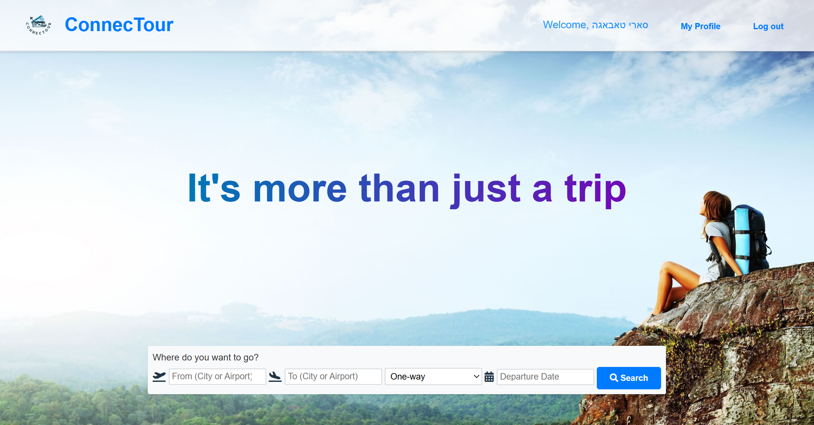
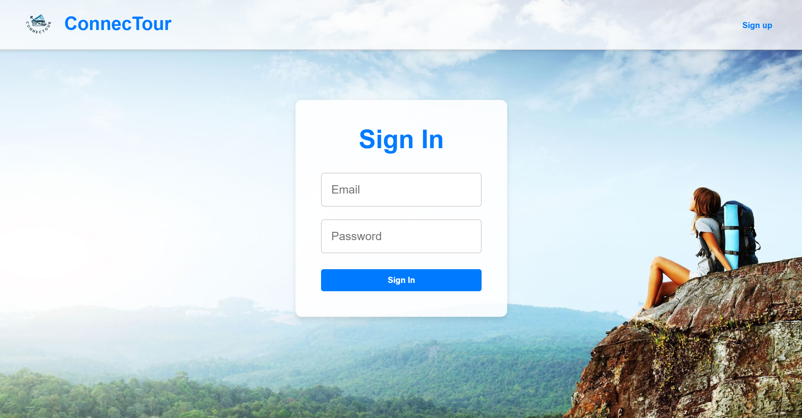
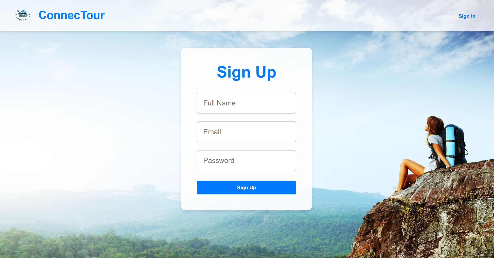
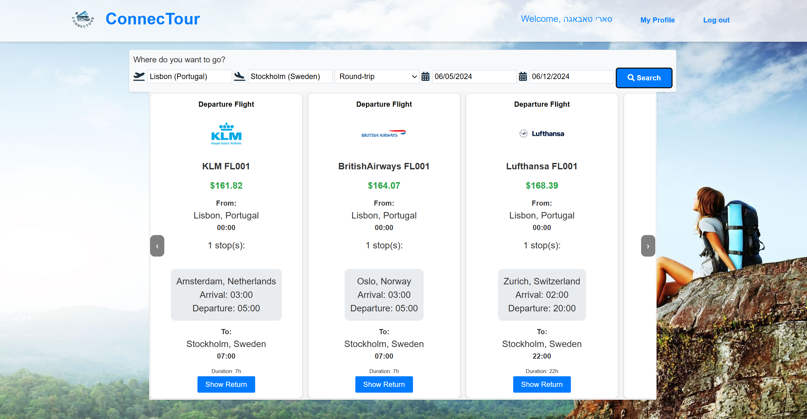
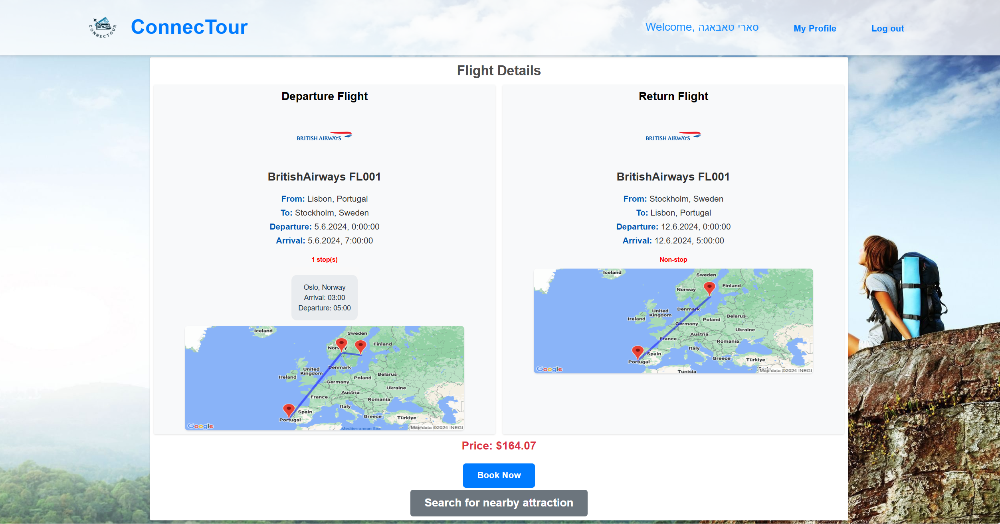
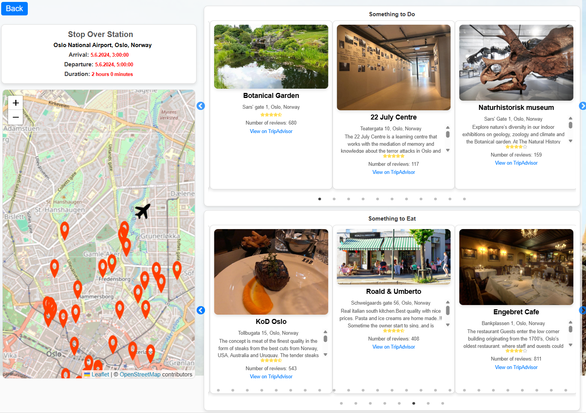
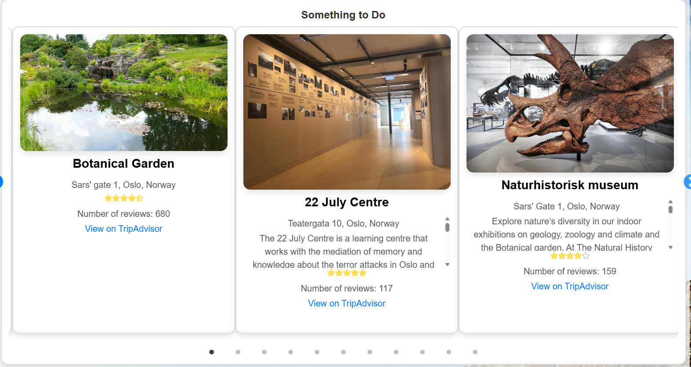
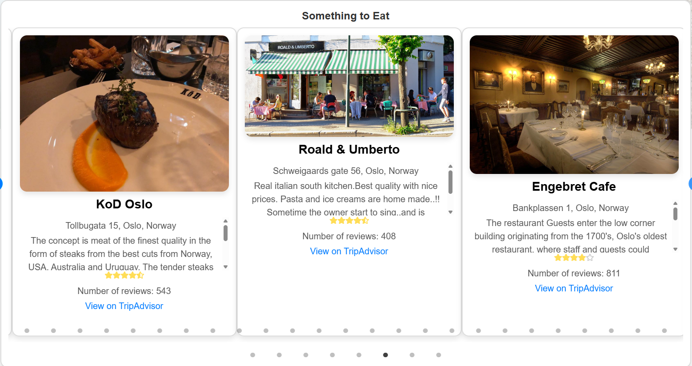
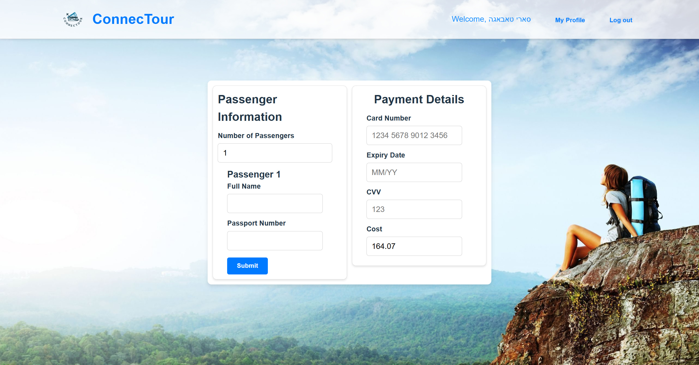

# ConnecTour

ConnecTour is a web application designed to enhance layover travel experiences by offering cost-effective flights and personalized attractions during stopovers.

## Features
- **User Authentication**: Sign-up and login functionality.
- **Flight Search & Booking**: Helps users find and book layover flights.
- **Personalized Recommendations**: AI-driven attraction suggestions based on user preferences.
- **Interactive UI**: Developed with **React**, ensuring a seamless user experience.
- **Efficient Backend**: Built using **Node.js** and **MongoDB**.

## System Architecture
ConnecTour follows a three-layer architecture:
1. **Presentation Layer**: Frontend built with React.
2. **Business Logic Layer**: Handles user authentication, flight search, and recommendations.
3. **Data Layer**: Stores user data, flights, and recommendations in MongoDB.

## Installation & Setup
### 1. Database Connection (MongoDB)
1. Login to [MongoDB Atlas](https://www.mongodb.com/).
2. Use the following credentials:
   - **Email**: `sre_tabaga_5@hotmail.com`
   - **Password**: `Saritabaja1212`
3. Navigate to **Network Access** > **ADD CURRENT IP ADDRESS**.

### 2. Running the Project in Visual Studio Code
1. Extract `ConnecTour-master.zip` and open the folder in **VS Code**.
2. Open **two terminals**:
   - Navigate to the frontend: `cd client`
   - Navigate to the backend: `cd server`
3. Install dependencies:
   - Client: `npm install vite`
   - Server: `npm install multer`
4. Start the project:
   - Client: `npm run dev`
   - Server: `node index.js`
5. The **client terminal** will display the local server URL where the project is running.

## Screenshots
### 1. Home Page

### 2. Login Page

### 3. Registration Page

### 4. Attraction selection

### 5. Search Flight

### 6. Flight Details

### 7. Personalized Recommendations

### 8. Attractions Recommendations

### 9. Restaurants Recommendations

### 10. User Profile

### 11. My Bookings

### 12. Payment Page

## Technologies Used
- **Frontend**: React, Vite
- **Backend**: Node.js, Express
- **Database**: MongoDB Atlas
- **Authentication**: JWT, Firebase
- **APIs**: Google Places API, RapidAPI

## Testing & Quality Assurance
- **Unit Tests**: Verified UI components and API endpoints.
- **Integration Tests**: Ensured smooth data flow between frontend and backend.
- **System Tests**: Tested full user flows (flight booking, attraction suggestions).

## Contributors
- **Sari Tabaga**
- **Rabia Braik**
- **Project Mentor**: Limor Matityahu
- **Instructor**: Yoram Roznovks

## License
This project is licensed under the [MIT License](LICENSE).
